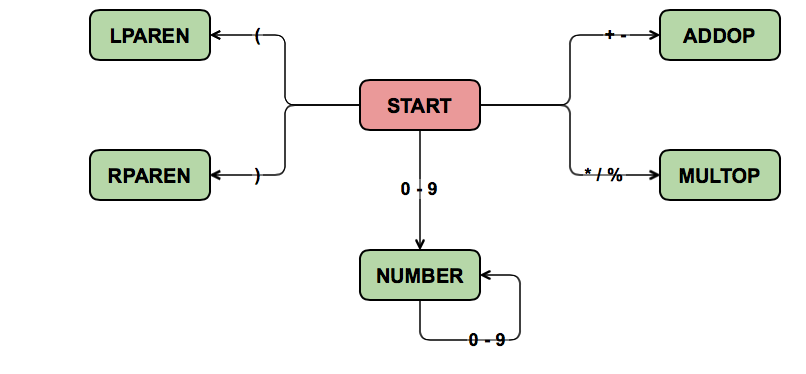

# COMP 232 - Scanner 2 (Transition Table)

In the previous lab, we build a specific scanner for a simple language. In this lab, we will generalize what we learned in the previous lab; we will encode descriptions of finite state machines in table format as **transition tables**.

Consider the following grammar for basic arithmetic expressions:

```
<expr> ::= <term> | <expr> <addop> <term>
<term> ::= <factor> | <term> <multop> <factor>
<factor> ::= <number> | <addop> <factor> | ( <expr> )
<number> ::= <digit> | <number> <digit>

<addop> ::= + | -
<multop> ::= * | / | %
<digit> ::= 0-9
```

We can quickly pick out the tokens:

* number
* addop
* multop
* left parenthesis (lparen)
* right parenthesis (rparen)

## FSM

From here, we can design a finite state machine (FSM) for tokenization:



Notice that this state machine omits an `INVALID` state, and all transitions to it; as we construct a scanner for this grammar, we will follow these rules for invalid tokens:

* A `NUMBER` cannot be followed by an invalid character (i.e. one not in the grammar); if an invalid character is encountered in the `NUMBER` state, then a transition to the `INVALID` state should be taken.
* An invalid character encountered in the `START` state should result in a transition to the `INVALID` state. 
* An invalid character encountered in any state other than `START`, `INT` or `INVALID` should lead to the current token being accepted (the invalid character is not part of the current token; it will be the start of the next (invalid) token).
* An `INVALID` token will consume any subsequent digits and invalid characters, until a white space character or a valid character (other than a digit) is encountered. Once such a character is encountered in the `INVALID` state, an `INVALID` token should be accepted.

## Transition Table

We can now encode this FSM in a table. We will first perform the encoding in a human-readable fashion, and then discuss the specifics of encoding it for use with the utilities provided in the lab download.

The first thing we must do is enumerate all of the types of tokens that can be returned, and all of the states in our machine.

**token types**:

* `INVALID_TOKEN`
* `NUMBER_TOKEN`
* `ADDOP_TOKEN`
* `MULTOP_TOKEN`
* `LPAREN_TOKEN`
* `RPAREN_TOKEN`

**machine states**:

* `START_STATE`
* `NUMBER_STATE`
* `ADDOP_STATE`
* `MULTOP_STATE`
* `LPAREN_STATE`
* `RPAREN_STATE`
* `INVALID_STATE`

Next, we need to partition the characters used as machine transitions into character classes.

**character classes**:

* `0-9`
* `+ -`
* `* / %`
* `(`
* `)`
* `\n \t\r`
* `other`

Most of the character classes above should be intuitive based on the FSM. Note the two extra classes, at the bottom. The first consists of the newline character, the space character, the tab character, and the carriage return character. This denotes the set of white space characters. For simplicity's sake, white space was not included in the FSM. White space characters are assumed to not be part of any token. They may be used to signify the end of a token, however; the string `1 1` would be tokenized as two number 1's, whereas `11` would be tokenized as a single number 11. The second extra character class is for any characters that do not fall into any of the other classes. Generally, when a character in this class (i.e. not in any other class) is encountered, it is either evaluated independently as an invalid token or it is evaluated as the end of an invalid token.

Finally, we can represent the FSM as a transition table:

|                     | **`0-9`**       | **`+ -`**     | **`* / %`**    | **`(`**        | **`)`**        | **`\n \r\t`** | **`other`**     |                 |
|:------------------- |:---------------:|:-------------:|:--------------:|:--------------:|:--------------:|:-------------:|:---------------:| ---------------:|
| **`START_STATE`**   | `NUMBER_STATE`  | `ADDOP_STATE` | `MULTOP_STATE` | `LPAREN_STATE` | `RPAREN_STATE` | *skip*        | `INVALID_STATE` | `INVALID_TOKEN` |
| **`NUMBER_STATE`**  | `NUMBER_STATE`  | *accept*      | *accept*       | *accept*       | *accept*       | *accept*      | *accept*        | `NUMBER_TOKEN`  |
| **`ADDOP_STATE`**   | *accept*        | *accept*      | *accept*       | *accept*       | *accept*       | *accept*      | *accept*        | `ADDOP_TOKEN`   |
| **`MULTOP_STATE`**  | *accept*        | *accept*      | *accept*       | *accept*       | *accept*       | *accept*      | *accept*        | `MULTOP_TOKEN`  |
| **`LPAREN_STATE`**  | *accept*        | *accept*      | *accept*       | *accept*       | *accept*       | *accept*      | *accept*        | `LPAREN_TOKEN`  |
| **`RPAREN_STATE`**  | *accept*        | *accept*      | *accept*       | *accept*       | *accept*       | *accept*      | *accept*        | `RPAREN_TOKEN`  |
| **`INVALID_STATE`** | `INVALID_STATE` | *accept*      | *accept*       | *accept*       | *accept*       | *accept*      | `INVALID_STATE` | `INVALID_TOKEN` |


Let's explore the transition table above.

The left-most column represents the current state of the machine. The top row represents the character class of the new character being processed. The contents of the table denote what action should be taken if the machine is in any state when it encounters a character from any class.

For instance, the `NUMBER_STATE` in the second column from the left and second row from the top means that if the FSM is in the `START_STATE` and it encounters a digit `0-9`, it should transition to the `NUMBER_STATE`.

While tokenizing, a buffer is used to hold all of the characters comprising the token being constructed. Whenever a state transition happens, the new character is added to this buffer, so when the token is done being constructed its entire value (in string form) is in the buffer.

Finally, the right-most column denotes which type of token should be returned if a token is *accepted* while the state machine is in the corresponding row's state.

Other than state transitions, there are two keywords in the table, each of which denotes a unique action:

* *accept* :
	* The contents of the buffer form a valid token.
	* The new character is not part of this valid token.
	* The new character is put back on the input stream (to be read as the start of the next token).
	* The contents of the buffer can be used to create the new token (with the appropriate type from the right-most column).
* *skip*:
	* The character that was just read is not part of any token, but does not denote the end of a token either.
	* Nothing needs to be done; move on to the next character.
	* This is generally only used for white space in the `START_STATE`; when white space is encountered in a different state, it generally signifies the end of a token which must be returned with an *accept*.

## Encoding the Transition Table

Once a transition table has been conceived, it can be written in a more concise format for use as the definition of a tokenizer.

The code provided in the lab handout takes tables exclusively in a very specific format. You'll want to open `table_0.table` in the `tables` folder, to read through it alongside this format. It is crucial that you carefully and exactly follow this format, or headaches await you.

* Line 1 consists as a single character, to be used as a delimiter later on in the table.
	* Choose a character that won't appear in the grammar, in `table_0.table` it is the comma.
	* Don't try to use a white space character! They will appear in the character classes!
* Line 2 consists of three integers, separated by spaces. These are (respectively):
	* The number of token types.
	* The number of states in the machine.
	* The number of character classes.
		* This includes any classes defined by **inclusion**, including the white space character class.
		* This does not include the `other` class (defined by **exclusion**), into which all excluded characters fall.
* Line 3 is a list of the names of all token types.
	* They are separated by the delimiter you listed on line 1.
	* Unless either your delimiter is a space or your token types' names include spaces, you should not include spaces on this line.
	* This is the string used to represent the token type, and will be what is printed as the token type in the output.
	* Escape sequences in token type names are not supported.
* Line 4 is a list of the names of all states in the FSM.
	* This is formatted just like the previous line: names separated by delimiters.
	* These names will never be printed, so they don't need to be pretty. Mine are descriptions, but integer names would work fine here.
	* Like token type names, state names do not support escape sequences.
* Line 5 is a list of all character classes, again separated by the delimiter.
	* The only escape sequences which are supported for use in character classes are `\n`, `\t`, and `\r`. If you wish to use other escape sequences in a character class, you'll need to edit `scanner.c` (ask and I'll show you where).
* The remaining lines encode the transition table itself. That is, they hold the contents of the table above.
	* Each line holds a row of the transition table.
	* The elements of a row are states or actions, separated by the delimiter (no extra spaces).
	* The left-most column of the "pretty" table above (denoting which state the machine is in) is omitted; it is for human-readability.
	* Similarly, top-most row (denoting the character classes) is also omitted; line 5 covers that part.
	* The first row should represent transitions out of the first state listed on line 4; the second row should represent the transitions out of the second state listed on line 4; and so on.
	* The first column should contain transitions taken when the first character class listed on line 5 is encountered; the second column should contain transitions taken when the second character class listed on line 5 is encountered; and so on.

You'll notice, reading through `table_0.table`, that some abbreviations have been made; `a` stands for *accept* and `s` for *skip*. This also means that `a` and `s` cannot be used as delimiters, nor can they be used as the names of states.

## Encoding Inputs

Inputs should be put in the `inputs` folder; inputs for task 1 should be labelled `input_1.txt` (or, if you have multiple, `input_1a.txt`, `input_1b.txt`, and so on). The same naming convention should be used for tasks 2 and 3, such that it is immediately apparent which task each input file is for.

A single input file has been provided for each task; see the [sample runs](#sample_runs). Note, however, that the provided inputs prioritize testing fringe cases of the invalid tokenizations; you will need to create tests with actual, valid grammar inputs and submit them and corresponding sample runs.

The contents of input files will depend on the grammar being tokenized; these contents should test your tokenizer for the specified grammar, both with valid and invalid inputs.

## Running the Project

In CLion, open the `Run` menu and select `Edit Configurations`. For the `scanner` executable, add two program arguments. The first should be the path to the table configuration file `../tables/table_0.table`, and the second the path to the corresponding sample input `../inputs/input_0.txt`. Check the first few lines of the `main` function in `main.c` to understand why!

After the run configurations have been set up, run! Compare `input_0.txt` to the output.

The result should be:

```
<INVALID_TOKEN &123>
<INT_TOKEN 12>
<INVALID_TOKEN $1>
<INT_TOKEN 1>
<ADDOP_TOKEN +>
<INT_TOKEN 2>
<INT_TOKEN 123>
<ADDOP_TOKEN +>
<INT_TOKEN 34>
<LPAREN_TOKEN (>
<INT_TOKEN 1>
<ADDOP_TOKEN +>
<INT_TOKEN 456>
<RPAREN_TOKEN )>
<MULTOP_TOKEN %>
<INT_TOKEN 1>
<INVALID_TOKEN @>
<INT_TOKEN 12>
<INVALID_TOKEN !>
<INT_TOKEN 123>
<INVALID_TOKEN .574asf>


Process finished with exit code 0
```

## TASK 1:

Expand the FSM and transition table above to work for the following grammar:

```
<expr> ::= <term> | <expr> <addop> <term>
<term> ::= <factor> | <term> <multop> <factor>
<factor> ::= <number> | <addop> <factor> | ( <expr> )
<number> ::= <int> | <float>

<int> ::= <digit> | <int> <digit>
<float> ::= <digit>. | <digit> <float> | <float> <digit>

<addop> ::= + | -
<multop> ::= * | / | %
<digit> ::= 0-9
```

You will need to submit your FSM; you may make the same simplifying ommission of the `INVALID` state that was done with the sample FSM.

Next, write out your transition table. Your human-readable table will be submitted as well; **do not** skip this step and go straight to the encoding. A similar convention is followed for the `INVALID` tokenization as in the sample, but details are outlined at the end of this task as well.

Finally, create `table_1.table` (in the `tables` folder) to match your modifications.

When you're done, use your table to tokenize the provided `input_1.txt`, and compare to the [sample runs](#sample_runs). This should serve as your test.

If you wish to challenge yourself, modify your table further so it accepts floats in all of these forms:

* `<digits> . <digits>`
* `<digits> .`
* `. <digits>`

but still outputs invalid tokens when given inputs like:

* `.`
* `.<non-digit characters>`

The conventions for invalid tokens from the preceeding example will be followed, and extended for the new grammar:

* An `INT` or `FLOAT` cannot be followed by an invalid character; if an invalid character is encountered in one of these states, then a transition to the `INVALID` state should be taken.
* A `FLOAT` cannot be followed immediately by an extra decimal point; this should also lead to a transition to the `INVALID` state.
* An invalid character encountered in the `START` state should result in a transition to the `INVALID` state. 
* An invalid character encountered in any state other than `START`, `INT`, `FLOAT`, or `INVALID` should lead to the current token being accepted.
* An `INVALID` token will consume any subsequent digits, periods, and invalid characters, until a white space character or a valid character (other than a digit or period) is encountered. Once such a character is encountered in the `INVALID` state, an `INVALID` token should be accepted.

## TASK 2:

Create an FSM and transition table for the following grammar. Like the previous task, your state machine and human-readable table will need to be submitted, so don't lose track of them! Omit the keywords `print` and `repeat` from your machine; they will be tokenized as keywords for this task.

```
<program> ::= <statement> | <statement> <program>
<statement> ::= <assignStmt> | <repeatStmt> | <printStmt>

<assignStmt> ::= <ident> = <expr> ;
<repeatStmt> ::= repeat ( <expr> ) <stmt>
<printStmt> ::= print <expr> ;

<expr> ::= <term> | <expr> <addOp> <term>
<term> ::= <factor> | <term> <multOp> <factor>
<factor> ::= <ident> | <number> | <factor> | <addop> <factor> | ( <expr> )
<number> ::= <int> | <float>

<int> ::= <digit> | <int> <digit>
<float> ::= <digit>. | <digit> <float> | <float> <digit>

<ident> ::= <letter> | <ident> <letter> | <ident> <digit>

<addOp> ::= + | -
<multOp> ::= * | / | %
<digit> ::= 0-9
<letter> ::= a-z | A-Z | _ | $
```

Encode your transition table in `table_2.table` in the `tables` folder.

A test case is provided in `input_2.txt`. Use your table to tokenize it and compare to the [sample run](#sample_runs) for task 2!

Invalid tokens are handled similarly to prior tasks, but extended for the new grammar:

* An `INT` or `FLOAT` cannot be followed by invalid characters or by letters; if an invalid character is encountered in one of these states, then a transition to the `INVALID` state should be taken.
* A `FLOAT` cannot be followed immediately by an extra decimal point; this should also lead to a transition to the `INVALID` state.
* An invalid character encountered in the `START` state should result in a transition to the `INVALID` state. 
* An invalid character encountered in any state other than `START`, `INT`, `FLOAT`, `IDENT`, or `INVALID` should lead to the current token being accepted.
* An `INVALID` token will consume any subsequent digits, periods, letters and invalid characters, until a white space character or a valid character (other than a digit, period, or letter) is encountered. Once such a character is encountered in the `INVALID` state, an `INVALID` token should be accepted.

## Task 3:

Create an FSM and transition table for the following grammar:

```
<logexpr> ::= 
	<proposition>
	| assert ( <proposition> )
	| retract ( <proposition> )
	| ( <logexpr> )
	| NOT <logexpr>
	| <logexpr> AND <logexpr>
	| <logexpr> OR <logexpr>

<letter> ::= [a-zA-Z_$]
<proposition> ::= '(<letter>| )+'
```
Note that the `<letter>` and `<proposition>` productions diverge from the notation we've been using previously for grammars, in favor of a more common notation for regular expressions.

A `<letter>` can be any of the following:

* a lowercase english alphabet letter `a-z`
* an uppercase english alphabet letter `A-Z`
* an underscore `_`
* a dollar sign `$`

A `<proposition>` is a set of single quotes `'` containing one or more `<letter>`s and/or spaces. Here "space" refers to the space character, not white space characters in general, so the space character will need to be in a separate character class from the other whitespace characters `\n\r\t`.

This time, your FSM and transition table must differentiate between keywords and other tokens; `assert`, `retract`, `AND`, `OR`, and `NOT` must all be tokenized individually. Also note that they are case-sensitive.

Handling of `INVALID` tokens should be done as follows:

* Keywords `assert`, `retract`, `AND`, `OR`, and `NOT` cannot be immediately followed by letters or invalid characters; this should lead to a transition to the `INVALID` state.
* An invalid character encountered in the `START` state should cause a transition to the `INVALID` state.
* Sequence of letters and/or invalid characters which are not keywords should be tokenized as `INVALID` tokens. In other words, if a keyword is "in progress" and you encounter a character which is either invalid or is not the right letter to continue the keyword, then a transition to the `INVALID` state should be taken.
* An `INVALID` token will consume any subsequent letters and invalid characters, until a white space character or a valid character (other than a letter) is encountered. Once such a character is encountered in the `INVALID` state, an `INVALID` token should be accepted.

## Submission Checklist

Your submission should include:

* State machines for all three tasks (which may omit the invalid state and its transitions).
* Human-readable transition tables for all three tasks.
* Encoded tables for all three tasks.
* Sample runs with your tables run on the provided inputs for all three tasks.
* Test inputs of your own creation, which rigorously test valid tokenizations.
	* Just write out a brief, valid program in each grammar that tests each token type, and which tests multiple cases for the token types with varying string values (like numbers and identifiers).
* Sample runs for your test inputs.

## Bonus Task (Optional, no extra credit)

This last task is optional. It is drastically harder than the assigned tasks, and I will provide far less direction.

Build a utility in C which takes as input a table (encoded in the format above, or in a different format of your conception) and creates a corresponding nested-cases scanner in C (like the one we made in the last lab).

Note that the goal is not to recreate what is done in the lab download. The implementation that was provided with the lab reads a file containing a table and then uses that configuration to tokenize an input in a different file.

The goal of this task is to instead translate the table configuration file to C code. In other words, the goal is to create a compiler which takes as input an encoded transition table and creates a hard-coded scanner (written in C) like the one we made in the previous lab.

It may be prudent to store all tokens' values in string form; the alternative is to add some metatdata about each token type to the table configuration denoting how the string value of the token is to be processed and stored.

## Sample Runs with provided inputs <a name="sample_runs"></a>

Don't forget to make actual, valid inputs for the grammars to test! Mine test some fringe cases for invalid tokens and do some testing for valid tokens, but they're unsatisfying spaghetti and your tests should be well-formatted valid inputs!

### Task 1

A successful task 1 run with the provided `input_1.txt` looks like this:

```
<INVALID_TOKEN &123.2>
<INVALID_TOKEN .5>
<INVALID_TOKEN 1.2.3>
<INT_TOKEN 1>
<ADDOP_TOKEN +>
<INT_TOKEN 2>
<INT_TOKEN 123>
<ADDOP_TOKEN +>
<FLOAT_TOKEN 34.5>
<LPAREN_TOKEN (>
<INT_TOKEN 1>
<ADDOP_TOKEN +>
<INT_TOKEN 456>
<RPAREN_TOKEN )>
<MULTOP_TOKEN %>
<FLOAT_TOKEN 1.00>
<INVALID_TOKEN @>
<INVALID_TOKEN 12!>
<INVALID_TOKEN 12!4>
<INVALID_TOKEN 123.574asf>


Process finished with exit code 0
```

### Task 2

A successful task 2 run with the provided `input_2.txt` looks like this:

```
<IDENT_TOKEN print>
<IDENT_TOKEN asdf>
<FLOAT_TOKEN 102.7>
<INVALID_TOKEN !!>
<MULTOP_TOKEN *>
<INVALID_TOKEN &>
<IDENT_TOKEN repeat>
<IDENT_TOKEN theAB123>
<INT_TOKEN 5692>
<SEMICOLON_TOKEN ;>
<LPAREN_TOKEN (>
<LPAREN_TOKEN (>
<RPAREN_TOKEN )>
<RPAREN_TOKEN )>
<IDENT_TOKEN asdf>
<LPAREN_TOKEN (>
<IDENT_TOKEN a>
<RPAREN_TOKEN )>
<MULTOP_TOKEN *>
<IDENT_TOKEN b>
<ADDOP_TOKEN +>
<IDENT_TOKEN c>
<ADDOP_TOKEN +>
<IDENT_TOKEN ccc>
<IDENT_TOKEN asdf>
<IDENT_TOKEN asdf>
<INVALID_TOKEN !>
<INVALID_TOKEN &a21.5>
<MULTOP_TOKEN *>


Process finished with exit code 0
```

### Task 3

A successful task 3 run with the provided `input_3.txt` looks like this:

```
<PROPOSITION_TOK 'sa asd a SE'>
<AND_TOK AND>
<OR_TOK OR>
<NOT_TOK NOT>
<ASSERT_TOK assert>
<RETRACT_TOK retract>
<INVALID_TOK 'asd>
<INVALID_TOK asse>
<INVALID_TOK retrac>
<INVALID_TOK NO>
<INVALID_TOK NOTA>
<INVALID_TOK ORi>


Process finished with exit code 0
```
